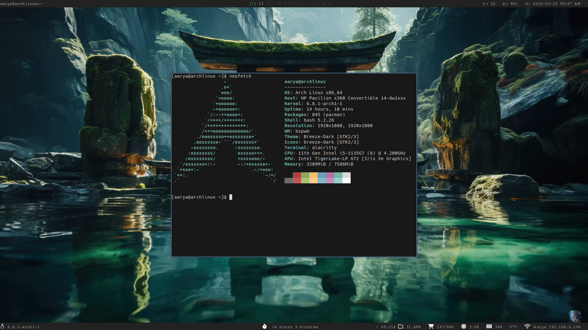

# My Lemonbar Config

- Lemonbar: https://github.com/LemonBoy/bar
- For icon support use this: https://github.com/drscream/lemonbar-xft

## Screenshot

## Notes
- Compile program with `make`, requires `gcc` compiler and supports only linux.
- Install python3+ to use scripts
- The `bin/topbar` program produces the text for the top panel
- The `bin/bottombar` program produces the text for the bottom panel
- The text is piped into lemonbar to display

## Update Modules
- Three ways to update widgets: persist, interval, signal
- Persist: reads stdout from a process and only updates the panel when new data is received, using epoll API
- Interval: runs a module after an interval
- Signal: updates a module when a SIGUSR1 is received
